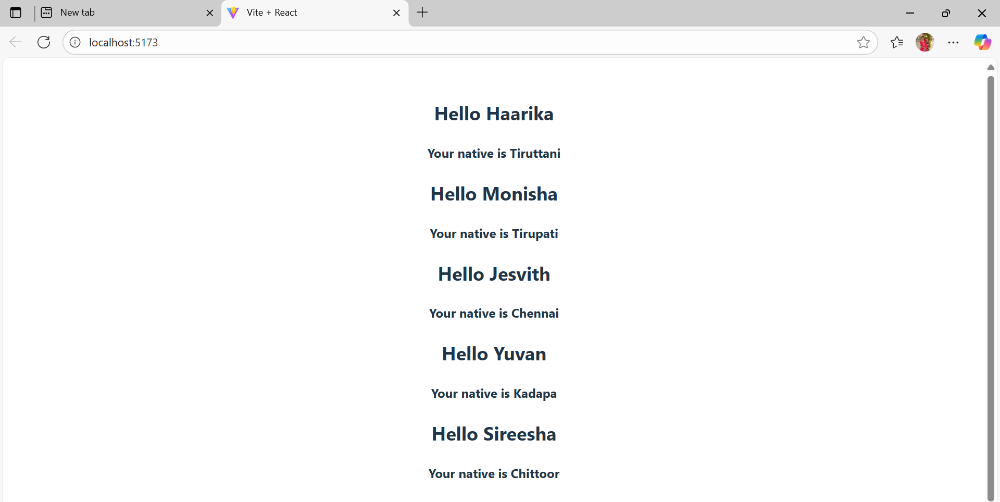

#  React Mini Project  - Props Demo

This project demonstrates the use of **props in React** by creating a simple and reusable component structure.  
It highlights how data can be passed from a parent component to child components in a clean and efficient way.

---

## 🚀 Features
- 📦 Demonstrates **React props** in action  
- 🔄 Reusable card component  
- 🎨 Styled with CSS for a neat look  
- ⚛️ Helps in understanding **component communication**

---

## 📸 Output

Here’s how the project looks:



---

## 🛠️ Getting Started

1. Clone the repository:
   ```bash
   git clone https://github.com/tgmonisha/react_props.git
   cd react_props
2. Install dependencies:

   npm install
3. Run the Project:
   
   npm run dev

